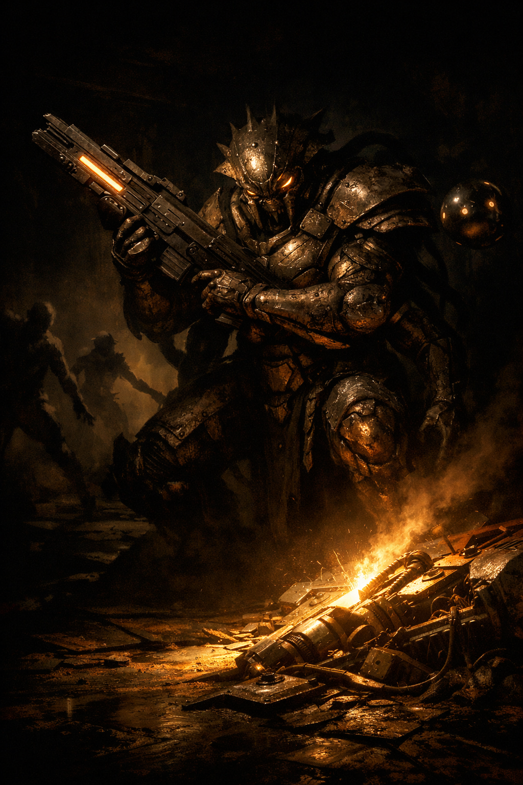
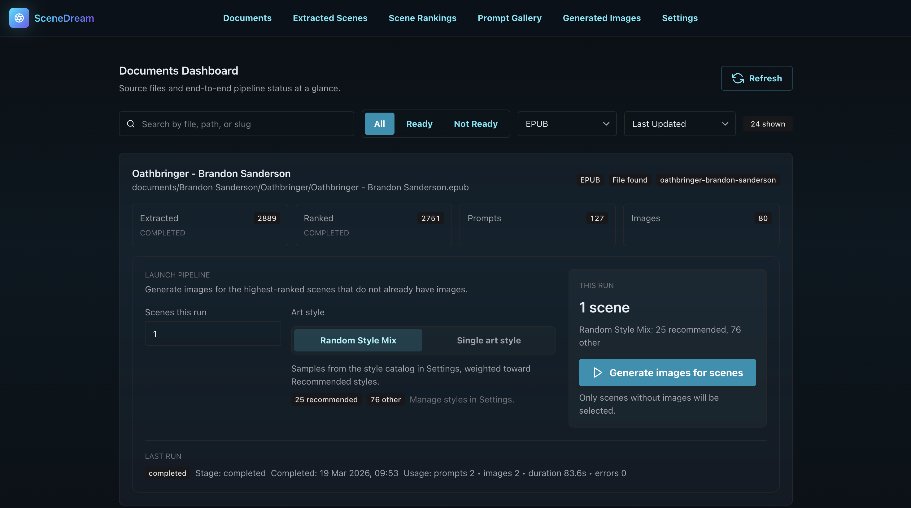

<h1 align="center">SceneDream</h1>



SceneDream is a project for automatically turning text based stories into AI generated images. You put in a story, and the best scenes are turned into images!

It's set up as a pipeline you run on your own computer that ingests source text, extracts cinematic scenes, ranks them, creates image generation prompts, and generates images.

All you'll need to get it working is an OpenAI API key and a text based story. You don't need to be technically savvy to use it, because it's all done through a web interface.

## The Interface

<table>
<tr>
<td width="50%">

<b>Documents Dashboard</b> —  Launch the pipeline from here. See how many scenes were extracted, how many have been ranked, how many prompts and images have been generated, and kick off a new run with one click.
</td>
<td width="50%">

<b>Generated Images</b> — Browse every image generated across all your documents. Filter by book, provider, or approval status. Click on an image to see the prompt that was used to generate it and the raw scene text that was used to create it.
</td>
</tr>
</table>

## Pipeline Overview

1. Ingest source documents (`.epub`, `.mobi`, `.txt`, `.md`, `.docx`)
2. Extract cinematic scenes
3. Discard any scenes that are not suitable for generation
4. Rank scenes for generation priority
5. Generate prompt variants
6. Generate images (Default to gpt-image-1.5)

## Architecture

- Backend: FastAPI + SQLModel + Alembic
- Frontend: React + TypeScript + Chakra UI + TanStack Router
- Database: PostgreSQL (pipeline metadata)
- Filesystem: `documents/` for source text files, `img/generated/` for outputs
- AI providers: Gemini/OpenAI (LLM tasks with automatic fallback) and OpenAI (image generation)

## Quickstart (Docker, Recommended)

Docker is free software that lets you run SceneDream without installing anything else on your computer. If you don't have it yet:

- Go to [docker.com/products/docker-desktop](https://www.docker.com/products/docker-desktop/) and download Docker Desktop for your operating system (Mac, Windows, or Linux).
- Install it like any other app and open it. You'll see a little whale icon in your menu bar or taskbar when it's running.

1. Create local environment config:

Create a .env file that is a copy of .env.example:
```bash
cp .env.example .env
```

2. Add your OpenAI API key in `.env` (you can generate one at [platform.openai.com/api-keys](https://platform.openai.com/api-keys)):
- `OPENAI_API_KEY` is sufficient for first-run extraction, ranking, prompt generation, and image generation.
- `GEMINI_API_KEY` is optional; when present, Gemini models remain the configured defaults with automatic OpenAI fallback.
- `XAI_API_KEY` is currently unused.

3. Add a story to the `documents/` folder:

Drop any `.epub`, `.mobi`, `.txt`, `.md`, or `.docx` file into the `documents/` directory. If you don't have one handy, the repo includes four public domain short stories you can use straight away:

- `E_A_Poe-The_Cask_of_Amontillado.md`
- `F_R_Stockton-The_Lady_or_the_Tiger.docx`
- `H_G_Wells-The_Star.txt`
- `W_W_Jacobs-The_Monkeys_Paw.epub`

4. Start the stack:

```bash
docker compose watch
```

5. Open the app:
- Dashboard: [http://localhost:5173](http://localhost:5173)
- API docs: [http://localhost:8000/docs](http://localhost:8000/docs)

## Quickstart (Run Backend/Frontend Directly)

1. Start only Postgres in Docker:

```bash
docker compose up -d db
```

2. Start backend:

```bash
cd backend
uv sync
uv run alembic upgrade head
uv run fastapi dev app/main.py
```

3. Start frontend in another terminal:

```bash
cd frontend
npm install
npm run dev
```

## Cost and Time Expectations

For a full pipeline run on an average novel (~80,000 words), generating images for **2 scenes**:

| Stage | Model | Estimated cost |
|---|---|---|
| Scene extraction & ranking | Gemini 2.5 Flash Lite | ~$0.01–$0.05 |
| Image prompt generation | Gemini (pro) | ~$0.01–$0.03 |
| Image generation (2 images) | gpt-image-1 | ~$0.08–$0.16 |
| **Total** | | **~$0.10–$0.25** |

When you first run the pipeline for a book, extraction and ranking will take the longest because they process the whole book. It can take 30 mins to 3+ hours depending on the size of the book.

Once extraction and ranking are complete, you don't have to do them again. Now every time you run the pipeline for that book, you are just generating prompts + images for the next highest ranked scenes. Multiple images will be generated for each extracted scene. Generating images will take around ten minutes per scene.

## First Workflow

1. Add source files under `documents/` (nested folders supported).
2. Go to [http://localhost:5173/documents](http://localhost:5173/documents)
3. Launch a pipeline run for a document.
4. Once the pipeline is done, go to [http://localhost:5173/generated-images](http://localhost:5173/generated-images) to see the images.

## Settings

The Settings page ([http://localhost:5173/settings](http://localhost:5173/settings)) lets you configure pipeline defaults and art style behavior without touching any code:

- **Default scenes per run** — how many scenes to process each time you launch a pipeline run.
- **Default art style mode** — choose between *Random Style Mix* (randomly samples from your style lists) or *Single art style* (always uses one specific style).
- **Recommended Styles / Other Styles** — two editable lists of art style descriptions that the random mix draws from. Edit these to steer the aesthetic of generated images toward styles you like.
- **Social media posting** — enable the social posting feature (disabled by default). At the moment, you can post to you Flickr and X.com accounts by clicking a button in the frontend. If you want to do that, you will need to add the appropriate API keys to the.env file. When disabled, posting controls are hidden across the app.

## Common Development Commands

```bash
cd backend && uv run pytest
cd backend && uv run bash scripts/lint.sh
cd frontend && npm run lint
cd frontend && npm run build
./scripts/generate-client.sh
```

## Pipeline CLI Commands

Run from `backend/`:

```bash
uv run python -m app.services.scene_extraction.main --help
uv run python -m app.services.scene_ranking.main rank --help
uv run python -m app.services.image_generation.main --help
```

## Troubleshooting

**Docker isn't running**
Make sure Docker Desktop is open and the whale icon is visible in your menu bar or taskbar before running `docker compose watch`.

**The app won't load at localhost:5173**
Give it 30–60 seconds after starting — the frontend container takes a moment to build on first run. Check `docker compose logs` if it still doesn't appear.

**API key errors / pipeline fails immediately**
Open your `.env` file and confirm `OPENAI_API_KEY` is set correctly with no extra spaces or quotes around the value.

**My document doesn't appear in the dashboard**
Make sure the file is placed directly in the `documents/` folder (or a subfolder within it) and is one of the supported formats: `.epub`, `.mobi`, `.txt`, `.md`, or `.docx`. Then refresh the page.

**Pipeline finishes but no images were generated**
Check that your OpenAI account has available credits at [platform.openai.com/usage](https://platform.openai.com/usage). A failed image generation step won't stop the rest of the pipeline from completing.

**Port conflict on 5173 or 8000**
Another app is already using that port. Stop it, or edit `docker-compose.yml` to map to a different local port.

## License

SceneDream is licensed under the [MIT License](LICENSE).

## Additional Documentation

- Backend details: [backend/README.md](backend/README.md)
- Frontend details: [frontend/README.md](frontend/README.md)
- Contribution guide: [CONTRIBUTING.md](CONTRIBUTING.md)
- Deployment notes: [deployment.md](deployment.md)

## Legal

See [LEGAL.md](LEGAL.md) for notes on copyright, fair use, and intended use under US law.
